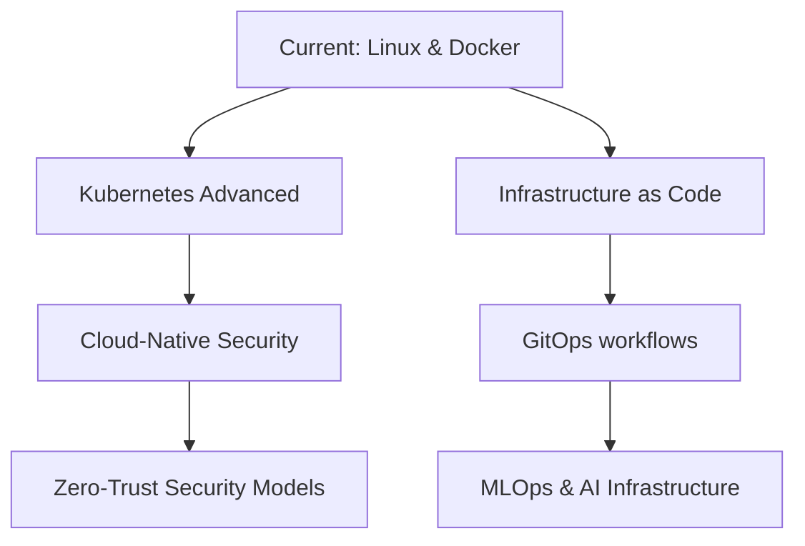

# Hi there 👋 I'm Hannibal

<!-- Dark/Light Mode Banner -->

  <picture>
    <source media="(prefers-color-scheme: dark)" srcset="https://github.com/hannibalshosting88/hannibalshosting88/blob/edcb4ceaa76b9f7c5f66c28d2a69abd685d7273d/.github/images/tauri.jpg">
    <source media="(prefers-color-scheme: light)" srcset="https://github.com/hannibalshosting88/hannibalshosting88/blob/edcb4ceaa76b9f7c5f66c28d2a69abd685d7273d/.github/images/tauri.jpg">
    
  </picture>

## 💫 About Me

I'm a versatile technical professional with expertise in vehicle assessment and IT infrastructure. I combine automotive knowledge with IT skills to deliver innovative solutions. I'm passionate about figuring things out - whether it's a complex server setup or a vehicle diagnostic puzzle!

<!-- Animated Terminal -->

  

## 🔧 Technologies & Tools

## 📊 GitHub Stats

  
  
  

## 🌱 Currently Learning

- Advanced Kubernetes Orchestration
- Microservices Architecture
- Infrastructure as Code (IaC)
- Advanced Python for Automation

## 🛠️ Projects in Progress

- Custom vehicle diagnostics reporting system
- Self-hosted cloud infrastructure for small businesses
- Automated server deployment scripts
- Linux-based IOT home solutions

## 🗺️ Learning Roadmap

## 🔄 Latest Activity

<!-- GITHUB_ACTIVITY:START -->
<!-- This section will be automatically updated by a GitHub Action -->
<!-- GITHUB_ACTIVITY:END -->

<!-- Spotify Now Playing -->

  

## ☕ Support My Work
If you find my projects helpful or just want to support my work, consider buying me a coffee!

  
  
  

## 🏆 Certifications

  

## 🌤️ Current Weather in Charlotte, NC 
<!-- WEATHER:START --> 🌡️ Temperature: 73°F 💨 Wind: 14 mph ☀️ Conditions: Clear sky 🌅 Updated: March 22, 2025 at 9:19 PM <!-- WEATHER:END -->

## 🖥️ My Tech Lab & Workspace

  
### Main Workstation

## 🖥️ Homelab Server & NAS Farm 🗄️

## 🚀 Highly Available Low-Power Mini Server's

### Cloud Infrastructure

## 

  
  ### 👋 Thanks for Visiting!
  ### You are visitor number
  
  
  ### to my profile!
  
  

