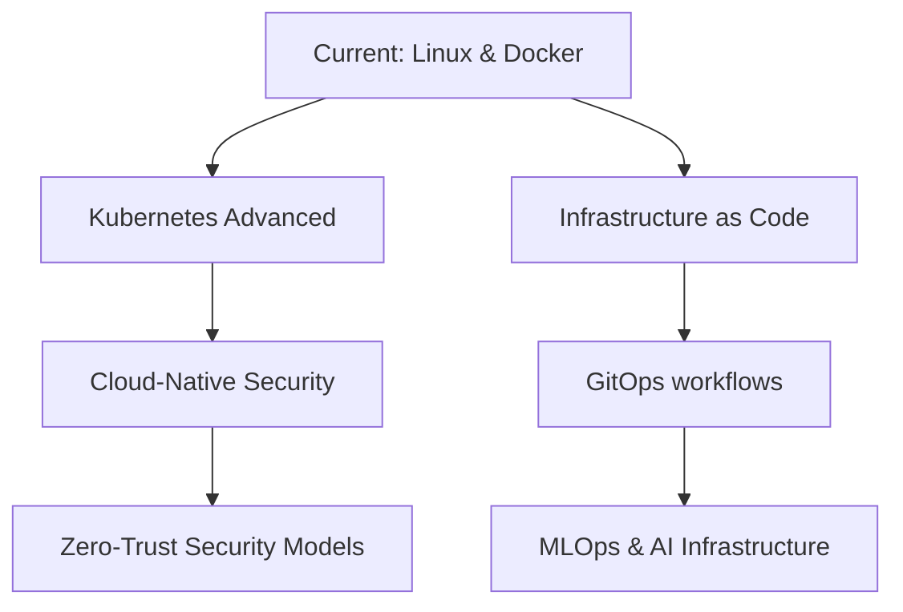

# Hi there 👋 I'm Hannibal

<!-- Dark/Light Mode Banner -->
<div align="center">
  <picture>
    <source media="(prefers-color-scheme: dark)" srcset="https://github.com/hannibalshosting88/hannibalshosting88/raw/main/assets/header-dark.svg">
    <source media="(prefers-color-scheme: light)" srcset="https://github.com/hannibalshosting88/hannibalshosting88/raw/main/assets/header-light.svg">
    
  </picture>
</div>

<div align="center">
  
</div>

## 💫 About Me

I'm a versatile technical professional with expertise in vehicle assessment and IT infrastructure. I combine automotive knowledge with IT skills to deliver innovative solutions. I'm passionate about figuring things out - whether it's a complex server setup or a vehicle diagnostic puzzle!

<!-- Animated Terminal -->
<div align="center">
  
</div>

## 🔧 Technologies & Tools


## 🚀 Skills

<div align="center">

### Linux Server Administration
```
█████████████████████████   95%
```

### Docker & Containerization
```
████████████████████████    90%
```

### Network Configuration
```
███████████████████████     85%
```

### Cloud Solutions
```
█████████████████████       80%
```

### Vehicle Assessment & Diagnostics
```
██████████████████████████  98%
```

</div>

## 📊 GitHub Stats

<div align="center">
  
  
  
</div>

## 🌱 Currently Learning

- Advanced Kubernetes Orchestration
- Microservices Architecture
- Infrastructure as Code (IaC)
- Advanced Python for Automation

## 🛠️ Projects in Progress

- Custom vehicle diagnostics reporting system
- Self-hosted cloud infrastructure for small businesses
- Automated server deployment scripts
- Linux-based IOT home solutions

## 🗺️ Learning Roadmap



## 🔄 Latest Activity

<!-- GITHUB_ACTIVITY:START -->
<!-- This section will be automatically updated by a GitHub Action -->
<!-- GITHUB_ACTIVITY:END -->

<!-- Spotify Now Playing -->
<div align="center">
  <a href="https://open.spotify.com/user/wilkinsirr">
    
  </a>
</div>
